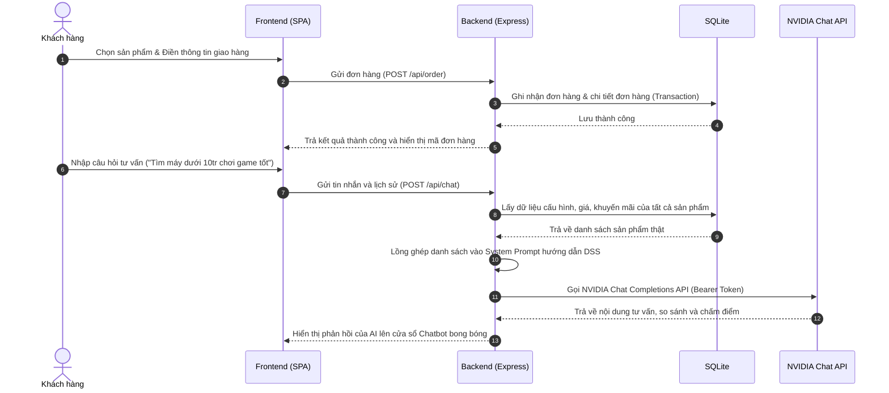

# BÁO CÁO BÀI TẬP LỚN MÔN HỌC
## ĐỀ TÀI: XÂY DỰNG WEBSITE THƯƠNG MẠI ĐIỆN TỬ BÁN ĐIỆN THOẠI TÍCH HỢP HỆ HỖ TRỢ RA QUYẾT ĐỊNH (DSS) BẰNG NVIDIA AI CHAT COMPLETIONS API

---

## GIỚI THIỆU CHUNG
Dự án tập trung vào việc giải quyết bài toán hỗ trợ khách hàng mua sắm thiết bị di động trực tuyến. Thay vì chỉ duyệt danh mục sản phẩm thụ động, hệ thống tích hợp **Trợ lý ảo AI (NVIDIA API)** đóng vai trò là một **Hệ hỗ trợ ra quyết định (Decision Support System - DSS)**. AI sẽ tự động phân tích nhu cầu, ngân sách và mục tiêu sử dụng của khách hàng để chấm điểm các máy hiện có, thực hiện so sánh thông số cấu hình và đưa ra đề xuất tối ưu giúp người dùng ra quyết định mua hàng một cách khoa học.

---

## 1. SƠ ĐỒ LUỒNG HỆ THỐNG (SYSTEM ARCHITECTURE)

Hệ thống hoạt động theo mô hình Client-Server. Dưới đây là sơ đồ luồng dữ liệu chi tiết của dự án:

---

## 2. THIẾT KẾ CƠ SỞ DỮ LIỆU (DATABASE SCHEMA)

Dự án sử dụng cơ sở dữ liệu nhúng SQLite lưu trữ tệp tin cục bộ (\`data/database.sqlite\`), giúp hệ thống vận hành gọn nhẹ, dễ dàng đóng gói và chấm điểm mà không cần cài đặt cấu hình máy chủ cơ sở dữ liệu phức tạp. Dữ liệu được khởi tạo tự động khi chạy mã nguồn (\`db.js\`).

### 2.1. Bảng `users` (Người dùng)
Lưu trữ thông tin tài khoản bao gồm cả khách hàng thường và tài khoản quản trị (role: `admin`).
- `id` (INT, Khóa chính, Auto Increment)
- `username` (VARCHAR, Unique) - Tên đăng nhập
- `password` (VARCHAR) - Mật khẩu đăng nhập
- `fullname` (VARCHAR) - Họ tên đầy đủ
- `role` (VARCHAR, mặc định 'customer') - Phân quyền (admin/customer)
- `email` (VARCHAR), `phone` (VARCHAR) - Thông tin liên hệ
- `created_at` (TIMESTAMP) - Thời gian tạo tài khoản

### 2.2. Bảng `products` (Sản phẩm điện thoại)
Lưu thông tin sản phẩm và các thuộc tính cấu hình phục vụ AI DSS phân tích.
- `id` (INT, Khóa chính, Auto Increment)
- `name` (VARCHAR, Unique) - Tên điện thoại
- `brand` (VARCHAR) - Thương hiệu (Apple, Samsung, Xiaomi, Oppo)
- `price` (DOUBLE) - Giá bán
- `screen`, `cpu`, `ram`, `rom`, `battery`, `camera` (VARCHAR) - Thông số chi tiết
- `image_url` (TEXT) - Link ảnh sản phẩm
- `description` (TEXT) - Mô tả sản phẩm
- `promotion` (TEXT) - Chương trình khuyến mãi
- **Thuộc tính DSS (Chất lượng đánh giá thang điểm 1-10):**
  - `rating_performance` (DOUBLE) - Điểm hiệu năng phần cứng
  - `rating_camera` (DOUBLE) - Điểm quay chụp
  - `rating_battery` (DOUBLE) - Điểm thời lượng sử dụng pin
  - `rating_price` (DOUBLE) - Điểm kinh tế Price/Performance (Giá rẻ thì điểm cao)

### 2.3. Bảng `orders` và `order_items` (Đơn hàng & Chi tiết)
- `orders`: Lưu thông tin chung của đơn hàng (`id`, `user_id`, `fullname`, `phone`, `email`, `address`, `total_price`, `status`, `created_at`).
- `order_items`: Lưu chi tiết các dòng sản phẩm trong đơn hàng (`id`, `order_id`, `product_id`, `quantity`, `price`).

### 2.4. Bảng `leads` (Khách hàng tiềm năng)
Lưu thông tin khi khách hàng để lại Email/SĐT thông qua chatbot AI hoặc biểu mẫu pop-up (`id`, `email`, `phone`, `source`, `created_at`).

---

## 3. THIẾT KẾ HỆ TRỢ GIÚP RA QUYẾT ĐỊNH (AI DSS PROCESS & PROMPTING)

Để AI có thể tư vấn chính xác, không ảo tưởng (hallucination) và hỗ trợ khách hàng ra quyết định tối ưu, Backend thực hiện quy trình sau tại endpoint `/api/chat`:

1. **Thu thập dữ liệu thời gian thực:** Backend truy vấn trực tiếp bảng `products` để lấy đầy đủ các sản phẩm kèm giá bán và chỉ số đánh giá thực tế từ kho lưu trữ.
2. **Thiết lập System Prompt định hướng quyết định:**
   Hệ thống dựng prompt yêu cầu AI tuân thủ quy trình hỗ trợ ra quyết định (DSS):
   - **Bước 1 (Phân tích nhu cầu):** Xác định ngân sách, thương hiệu yêu thích và mục đích mua (chơi game, quay chụp, pin bền).
   - **Bước 2 (So sánh - Chấm điểm):** Trích xuất 2-3 sản phẩm tiềm năng, lập bảng hoặc phân tích so sánh cấu hình và các chỉ số điểm (Hiệu năng, Camera, Pin, Kinh tế) có sẵn trong DB.
   - **Bước 3 (Đề xuất tối ưu):** Chỉ ra chính xác 1 sản phẩm khuyên dùng nhất (Best Choice) và giải thích tại sao.
   - **Bước 4 (Kêu gọi hành động):** Nhắc nhở quà tặng đi kèm và hướng dẫn đặt mua trực tiếp tại website.
3. **Cơ chế Failover (Chế độ Ngoại tuyến):**
   Trong trường hợp API NVIDIA gặp lỗi kết nối hoặc chưa cấu hình API Key, Backend tích hợp thuật toán phân tích từ khóa offline để tự động so sánh, chấm điểm, sắp xếp sản phẩm dựa trên thuộc tính điểm số DSS từ DB và trả về kết quả cấu trúc hoàn chỉnh giúp buổi trình bày/chấm điểm dự án không bị gián đoạn.

---

## 4. HƯỚNG DẪN TRIỂN KHAI LÊN HOSTING MIỄN PHÍ

### 4.1. Triển khai Backend & Frontend lên Render.com (Miễn phí)
Render hỗ trợ tạo ứng dụng Node.js miễn phí chạy trực tiếp cả Web tĩnh và API.
1. Đẩy mã nguồn dự án lên một kho chứa **GitHub** cá nhân (Private hoặc Public).
2. Đăng ký tài khoản tại [Render.com](https://render.com/).
3. Nhấp chọn **New** -> **Web Service**.
4. Kết nối tài khoản GitHub của bạn và chọn Repository chứa dự án.
5. Thiết lập thông số:
   - **Runtime:** `Node`
   - **Build Command:** `npm install`
   - **Start Command:** `npm start`
6. Cuộn xuống phần **Environment Variables** (Biến môi trường) và thêm các biến:
   - `PORT` = `10000` hoặc tự động chọn.
   - `NVIDIA_API_KEY` = `[API key của bạn từ NVIDIA]`
   - `NVIDIA_MODEL` = `moonshotai/kimi-k2.6` (hoặc model tùy chọn khác)
7. Nhấn **Deploy Web Service** và chờ Render cài đặt. Khi thành công, bạn sẽ nhận được một địa chỉ đường dẫn miễn phí có đuôi `.onrender.com`.

